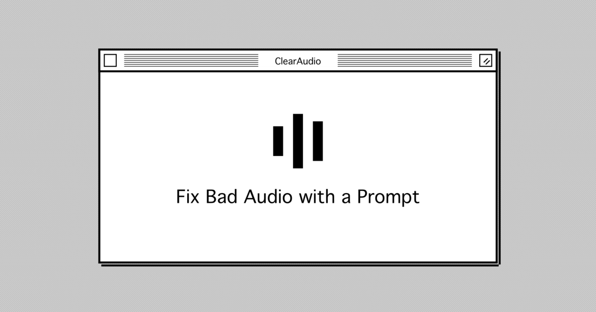

# ClearAudio

**Fix bad audio with a prompt.**



<p align="center">
  <a href="https://clearaudio.app"><strong>Try it live →</strong></a>
</p>

Upload audio or video, describe what you want to keep ("the speaker", "the voice", "the music"), and we'll clean up the rest. Powered by Meta's [SAM-Audio](https://github.com/facebookresearch/sam-audio) via [fal.ai](https://fal.ai).

## Prerequisites

- [Bun](https://bun.sh/) (v1.0+)
- [fal.ai API key](https://fal.ai/dashboard/keys) — for serverless audio separation
- [Vercel Blob](https://vercel.com/docs/storage/vercel-blob) — for file uploads and storage
- [Neon Database](https://neon.tech/) — PostgreSQL for auth and usage tracking
- [Resend](https://resend.com/) — for magic link emails
- [Google Cloud Console](https://console.cloud.google.com/) — for Google OAuth (optional)

## Getting Started

```bash
# Install dependencies
bun install

# Set up environment variables
cp apps/web/.env.example apps/web/.env.local
# Fill in your values (see apps/web/.env.example for details)

# Run development server
bun run dev
```

The app will be available at [http://localhost:3000](http://localhost:3000).

## Environment Variables

**Required (`apps/web/.env.local`):**

| Variable | Description |
|----------|-------------|
| `FAL_KEY` | [fal.ai API key](https://fal.ai/dashboard/keys) |
| `BLOB_READ_WRITE_TOKEN` | [Vercel Blob](https://vercel.com/docs/storage/vercel-blob) token |
| `DATABASE_URL` | PostgreSQL connection string ([Neon](https://neon.tech/)) |
| `BETTER_AUTH_SECRET` | Random secret (`openssl rand -base64 32`) |
| `BETTER_AUTH_URL` | Base URL (default: `http://localhost:3000`) |
| `RESEND_API_KEY` | [Resend](https://resend.com/) API key |

**Optional:**

| Variable | Description |
|----------|-------------|
| `GOOGLE_CLIENT_ID` | Google OAuth client ID |
| `GOOGLE_CLIENT_SECRET` | Google OAuth client secret |

## Tech Stack

- **Framework:** Next.js 16, React 19, TypeScript
- **Audio AI:** [SAM-Audio](https://github.com/facebookresearch/sam-audio) via [fal.ai](https://fal.ai)
- **Auth:** Better Auth (magic link + Google OAuth)
- **Database:** Neon PostgreSQL + Drizzle ORM
- **Payments:** Stripe
- **Storage:** Vercel Blob
- **Styling:** Tailwind CSS

## License

This project's code is licensed under the [MIT License](LICENSE).

**Note:** This project uses [SAM-Audio](https://github.com/facebookresearch/sam-audio) by Meta, which is licensed under Meta's SAM License. By using this project, you agree to comply with the SAM License terms. See [THIRD_PARTY_LICENSES.md](THIRD_PARTY_LICENSES.md) for details.
